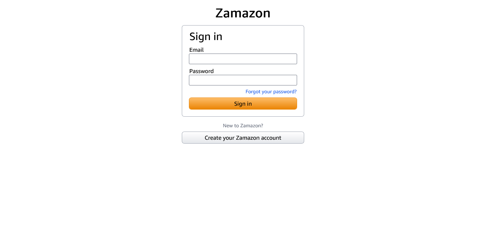

# Amazon clone

This repository contains a Amazon clone project developed using **React**, **Nextjs** and **Tailwindcss**. The project aims to replicate the user interface of the popular social media platform, **Amazon**.

## Screenshots

Here are a few screenshots of the Amazon clone project:

### Home page


### Home Products page


### Cart page


### SignIn page



### SignUp page


## Installation
To run the Facebook clone project locally, follow these steps:

### 1- Clone the repository:
  ```git clone https://github.com/khalilrume/amazonclone-fronend.git```
  
### 2- Navigate to the project directory:
  ```cd amazonclone-fronend```
  
### 3- Install the dependencies:
  ```npm install```
  
### 4- Start the development server:
  ```npm run dev```
  
### 5- Open your web browser and visit http://localhost:3000 to view the Facebook clone.
